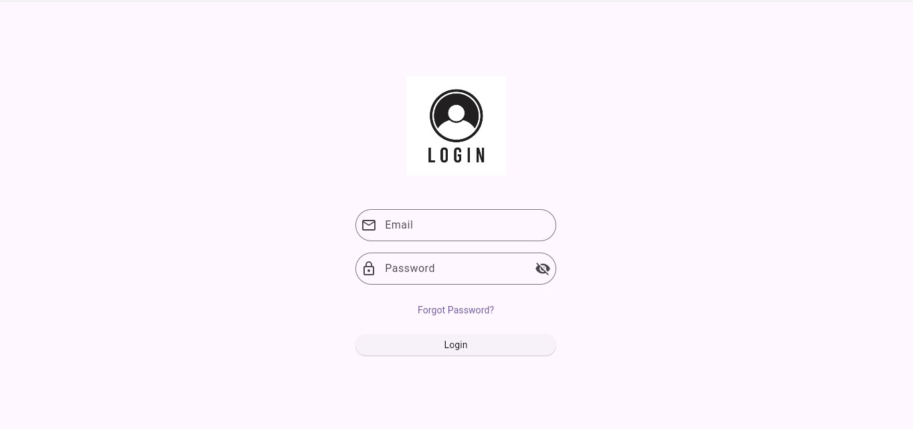
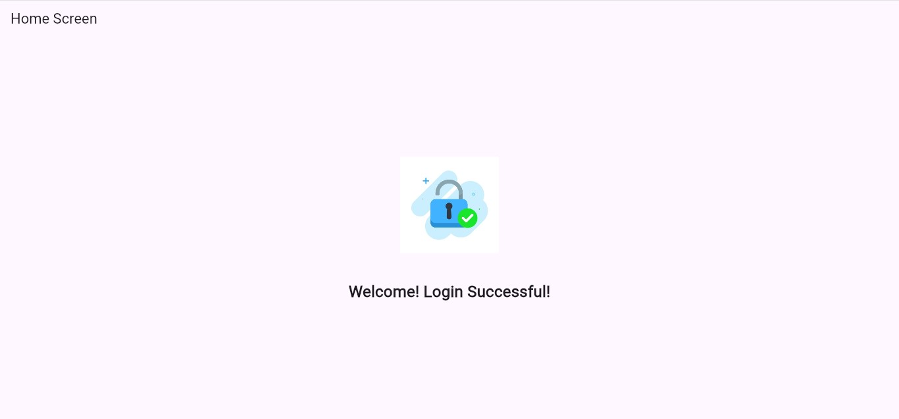

# Flutter Login UI App

A simple Flutter Login Application with:

- Email & Password Login
- Password Hide/Show Feature
- Login Authentication
- Success Screen
- Login Successful Image

# Features

- User Login Screen  
- Email Validation  
- Password Validation  
- Hide / Show Password  
- SnackBar Error Messages  
- Navigation to Home Screen  
- Success Message with Image  
- Clean UI Design

# Screenshots

# Working

- Add any email & password of your choice in line 33 and 34 of the code in login.dart.

# GitHub repository

github ""